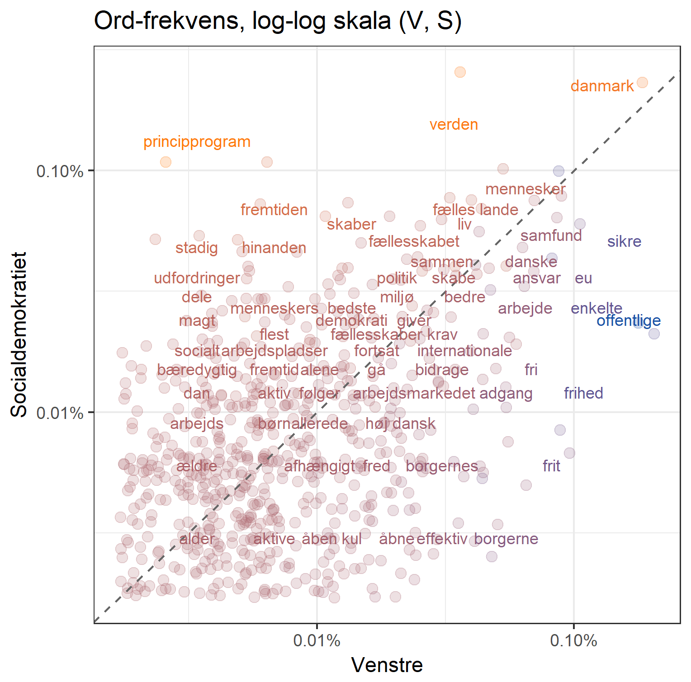

# Folketingets partiers principprogrammer

## Sentiments
Dette projekt handler om at bruge partiernes princip-programmer til at forstå forskelle og ligheder mellem dem.

Som det første bruger vi den danske AFINN liste til at få sentiment scores på alt teksten. Et rullende gennemsnit af sentiments over 50 ord viser for De Radikale tydelige tegn på at partiet behandler forskellige politiske emner samlet i deres program.

På lignende vis kan vi løbende summere hvert dokuments samlede sentiment score (AFINN ranker ord på [-5;5]). På den måde kan vi både se hvilke partier der har de længste programmer, og hvilke der formulerer sig mest positivt gennem partiprogrammet. (Ikke overraskende har DF både det længste og mest negative partiprogram overhovedet, mens Alternativet skriver mest positivt)

## Frekvenser

Hvilke ord partierne skriver mest i deres programmer (målt i forhold til programmets samlede længde) er ikke tilfældigt. At to partier nævner ord lige meget er til gengæld en god indikator på at partierne kan blive enige om disse emner i folketingssalen.

I de følgende plots markerer den stiplede linje en 45-graders linje, og nu tættere ordende ligger på denne linje, nu ens er partierne i deres brug af ordet.

For S og V samler de fleste punkter sig omkring midten, men med betydelig spredning - muligvis fordi partierne bekymrer sig om de samme områder, men har forskellige holdninger dertil.

På ventrefløjen er Enhedslistens program tilsyneladende mere tætskrevet (de fleste ord optræder med højere frekvens end hos Alternativet), men man halter bagefter på bl.a. nøgleord som "bæredygtighed".

På den modsatte fløj skal De Konservative og Liberal Alliance blive enige i regeringen. Her er der nogenlunde enighed, med undtagelse De Konservatives brug af klassisk-konservative ord.

