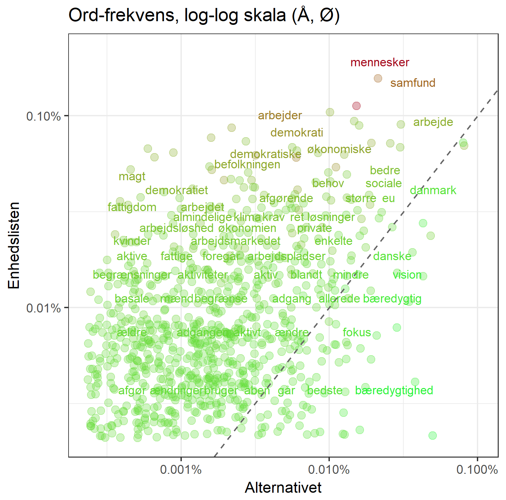

## Folketingets partiers programmer

Dette projekt handler om at bruge partiernes princip-programmer til at forstå forskelle og ligheder mellem dem. Helt grundlæggende kan vi for eksempel bruge den danske AFINN sentiment liste til at forstå hvilke partier der skriver i mest positive vendinger.

Eller lige så simpelt: scatterplots med partiernes procentuelle brug af forskellige ord, som meget fint illustrerer hvor man er politisk enige og uenige - se for eksempel Venstre og Socialdemokratiet

Eller den yderste venstrefløj, hvor Alternativet taler om bæredygtighed og økologi, mens Enhedslisten snakker om arbejdere og demokrati.

På den modsatte fløj skal De Konservative og Liberal Alliance blive enige i regeringen. 

